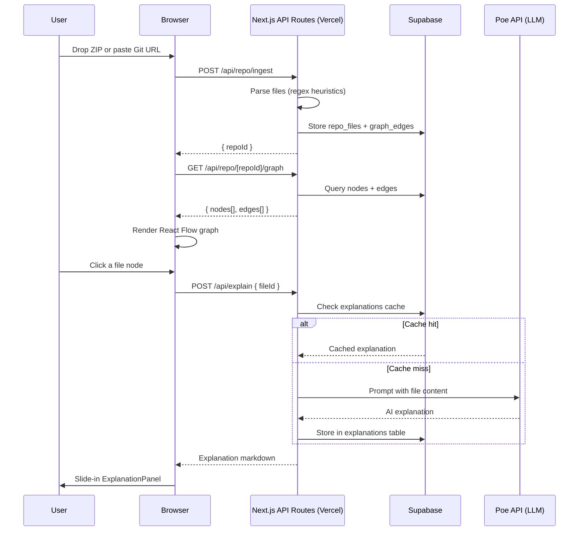

# CodeViz — Project Specification

> **Tagline:** Drop a repo, understand it instantly — interactive dependency graphs with AI-powered explanations.

---

## 1. Project Overview

- **Name:** CodeViz
- **Target users:** Developers onboarding to an unfamiliar codebase; learners studying real-world code.
- **Core value loop:** User provides a repo → app parses it into a file-level dependency graph → user clicks any node → AI explains that file in plain English (result cached for future clicks).

---

## 2. Feature List

| # | Feature | Notes |
|---|---------|-------|
| 1 | Repo ingestion via drag-and-drop ZIP upload | HTML5 File API |
| 2 | Repo ingestion via remote Git URL | GitHub, GitLab, Bitbucket |
| 3 | File-level dependency graph visualisation | Nodes = files, edges = import direction |
| 4 | Language-agnostic heuristic parser | Regex-based, best-effort across all languages |
| 5 | On-click AI explanation panel | Lazy generation, persistent cache |
| 6 | OAuth authentication | GitHub and Google via NextAuth.js |
| 7 | User dashboard with saved repos & history | Accounts with `last_viewed_at` tracking |
| 8 | Delete repository with full cascade | Removes files, edges, and cached explanations |

---

## 3. Tech Stack

| Layer | Choice | Rationale |
|-------|--------|-----------|
| Framework | **Next.js 14 (App Router)** | Full-stack, serverless-ready, TypeScript-first |
| Language | **TypeScript** | Type safety across frontend and API routes |
| Styling | **Tailwind CSS** | Utility-first, fast iteration |
| Auth | **NextAuth.js v5** | GitHub + Google OAuth, session management |
| Database & Storage | **Supabase** (Postgres + Storage) | Managed Postgres, file storage, real-time ready |
| Graph UI | **React Flow** | Interactive node/edge canvas, extensible |
| Graph Layout | **dagre** | Hierarchical auto-layout for dependency graphs |
| Git cloning | **isomorphic-git** + `@isomorphic-git/http` | Clone remote repos in serverless `/tmp` |
| AI explanations | **Poe API** (OpenAI-compatible endpoint) | Centrally managed key, no user key required |
| Deployment | **Vercel** (serverless/edge functions) | Native Next.js support, zero-config CI/CD |

---

## 4. Architecture



---

## 5. Data Models

### `users`

| Column | Type | Notes |
|--------|------|-------|
| `id` | `uuid` PK | Supabase auth UID |
| `email` | `text` | |
| `name` | `text` | |
| `avatar_url` | `text` | |
| `created_at` | `timestamptz` | |

### `repositories`

| Column | Type | Notes |
|--------|------|-------|
| `id` | `uuid` PK | |
| `user_id` | `uuid` FK → users | |
| `name` | `text` | Repo name |
| `source_type` | `enum('upload','git_url')` | |
| `source_url` | `text` | Null for uploads |
| `file_count` | `int` | |
| `last_viewed_at` | `timestamptz` | Updated on each graph view |
| `created_at` | `timestamptz` | |

### `repo_files`

| Column | Type | Notes |
|--------|------|-------|
| `id` | `uuid` PK | |
| `repo_id` | `uuid` FK → repositories | |
| `path` | `text` | Relative path within repo |
| `content` | `text` | Raw file content |
| `language` | `text` | Detected language (heuristic) |

### `graph_edges`

| Column | Type | Notes |
|--------|------|-------|
| `id` | `uuid` PK | |
| `repo_id` | `uuid` FK → repositories | |
| `source_file_id` | `uuid` FK → repo_files | File that imports |
| `target_file_id` | `uuid` FK → repo_files | File being imported |

### `explanations`

| Column | Type | Notes |
|--------|------|-------|
| `id` | `uuid` PK | |
| `file_id` | `uuid` FK → repo_files | Unique per file |
| `content` | `text` | Markdown from Poe API |
| `created_at` | `timestamptz` | |

---

## 6. API Contracts

| Method | Route | Auth | Description |
|--------|-------|------|-------------|
| `POST` | `/api/repo/ingest` | Required | Accept ZIP (`multipart/form-data`) or `{ gitUrl }` JSON; returns `{ repoId }` |
| `GET` | `/api/repo/[repoId]/graph` | Required | Returns `{ nodes: FileNode[], edges: Edge[] }` for React Flow |
| `DELETE` | `/api/repo/[repoId]` | Required | Cascade-delete repo, files, edges, explanations |
| `POST` | `/api/explain` | Required | Body: `{ fileId }`; returns `{ explanation: string }` (cached or freshly generated) |
| `GET/POST` | `/api/auth/[...nextauth]` | — | NextAuth.js OAuth handler |

### `FileNode` shape

```json
{
  "id": "string",
  "data": {
    "label": "string",
    "path": "string",
    "language": "string"
  },
  "position": { "x": 0, "y": 0 }
}
```

### `Edge` shape

```json
{
  "id": "string",
  "source": "string",
  "target": "string",
  "animated": true
}
```

---

## 7. Page & Component Map

```
app/
├── page.tsx                        # Landing page with RepoDropzone + Git URL input
├── dashboard/page.tsx              # Saved repos list + recently viewed
├── repo/[repoId]/page.tsx          # Graph visualisation page
├── (auth)/login/page.tsx           # OAuth sign-in page
├── api/
│   ├── auth/[...nextauth]/route.ts
│   ├── repo/ingest/route.ts
│   ├── repo/[repoId]/graph/route.ts
│   ├── repo/[repoId]/route.ts      # DELETE
│   └── explain/route.ts

components/
├── Navbar.tsx
├── RepoDropzone.tsx
├── DependencyGraph.tsx
├── FileNode.tsx                    # Custom React Flow node
└── ExplanationPanel.tsx

lib/
├── supabase.ts                     # Typed Supabase client
├── auth.ts                         # NextAuth config + Supabase callbacks
└── parser.ts                       # Regex-based import heuristics

middleware.ts                       # Protect /dashboard and /repo/* routes
```

---

## 8. Non-Functional Requirements

| Category | Requirement |
|----------|-------------|
| **Performance** | Graph render must handle up to 500 file nodes without jank; use React Flow's virtualization |
| **Ingestion limits** | Max ZIP size: 50 MB; max file count per repo: 1 000 files |
| **AI cost control** | Explanations are generated once and cached indefinitely per file; no re-generation unless file changes |
| **Security** | All API routes validate session via NextAuth; Supabase RLS policies enforce per-user data isolation |
| **Serverless constraints** | Ingestion and cloning must complete within Vercel's 60 s function timeout; large repos cloned to `/tmp` (max 512 MB on Vercel) |
| **Parsing accuracy** | Heuristic parser is best-effort; unresolved imports are silently skipped (no hard errors) |
| **Accessibility** | Graph canvas must support keyboard navigation for node selection |
| **Scalability** | Supabase Postgres handles persistence; stateless API routes scale horizontally on Vercel |

---

## 9. Environment Variables

| Variable | Used by |
|----------|---------|
| `NEXTAUTH_SECRET` | NextAuth.js |
| `NEXTAUTH_URL` | NextAuth.js |
| `GITHUB_CLIENT_ID` / `GITHUB_CLIENT_SECRET` | GitHub OAuth |
| `GOOGLE_CLIENT_ID` / `GOOGLE_CLIENT_SECRET` | Google OAuth |
| `NEXT_PUBLIC_SUPABASE_URL` | Supabase client |
| `NEXT_PUBLIC_SUPABASE_ANON_KEY` | Supabase client |
| `SUPABASE_SERVICE_ROLE_KEY` | Server-side Supabase admin |
| `POE_API_KEY` | Poe API calls in `/api/explain` |
